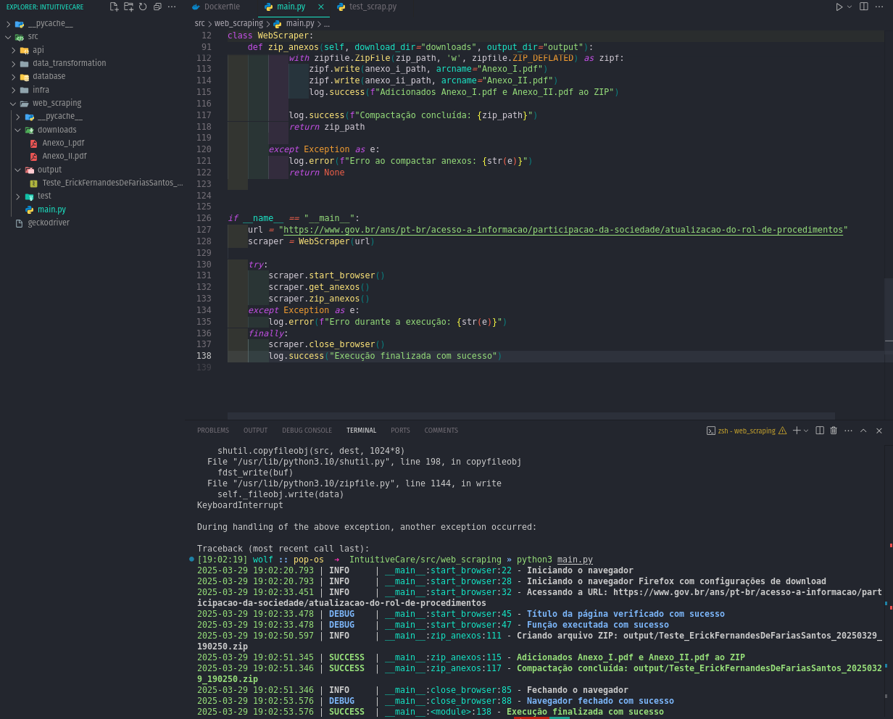

# Documentação de scripts Python

## Web Scraping

## Objetivo do Projeto

Desenvolvi uma solução automatizada para acessar o portal da Agência Nacional de Saúde Suplementar (ANS) no domínio [www.gov.br](http://www.gov.br/), especificamente na seção de **Atualização do Rol de Procedimentos**, com as seguintes funcionalidades:

1. **Acesso automatizado** ao portal oficial
2. **Download seguro** dos anexos I e II em formato PDF
3. **Processamento e compactação** dos documentos

## Implementação Técnica

O sistema foi desenvolvido em Python utilizando as seguintes tecnologias:

- **Selenium**
- **loguru**
- **os**
- **urllib**
- **datetime**

```python
pip install Selenium loguru urllib datetime
```

### Script do Projeto:

```python
from selenium import webdriver as wb
from selenium.webdriver.common.by import By
from selenium.webdriver.support.ui import WebDriverWait
from selenium.webdriver.support import expected_conditions as EC
from loguru import logger as log
import os
from urllib.request import urlretrieve
import zipfile
from datetime import datetime as dt

class WebScraper:
    def __init__(self, url):
        self.url = url
        self.driver = None
        
    
    # Essa função aqui vai iniciar o navegador
    # e acessar a URL desejada
    def start_browser(self):
        try:
            log.info("Iniciando o navegador")
            options = wb.FirefoxOptions()
            options.set_preference("browser.download.folderList", 2)
            options.set_preference("browser.download.dir", "/home/wolf/Downloads")
            options.set_preference("browser.helperApps.neverAsk.saveToDisk", "application/pdf")
            
            log.info("Iniciando o navegador Firefox com configurações de download")
            self.driver = wb.Firefox(options=options)
            
            self.driver.get(self.url)
            log.info(f"Acessando a URL: {self.url}")

            #self.driver.maximize_window()
            #log.info("Maximizando a tela")
            
            #log.info(f"Título atual: {self.driver.title}")
            #log.info(f"URL atual: {self.driver.current_url}")

            # Fazendo uma verificação mais robusta do título da página
            WebDriverWait(self.driver, 10).until(
                EC.title_contains("Atualização do Rol de Procedimentos")
            )
            log.debug("Título da página verificado com sucesso")

            log.debug("Função executada com sucesso")
            #self.driver.find_element(By.XPATH, "/html/body/div[2]/div[1]/main/div[2]/div/div/div/div/div[2]/div/ol/li[1]/a[1]").click()

        except Exception as e:
            log.error(f"Erro ao iniciar o navegador: {str(e)}")
            if self.driver:
                self.driver.quit()
            return False

    def get_anexos(self, download_dir="downloads"):
        """Baixa os anexos usando urllib (biblioteca padrão)"""
        try:
            os.makedirs(download_dir, exist_ok=True)
            
            # Localiza os links dos anexos
            anexo_i = WebDriverWait(self.driver, 15).until(
                EC.presence_of_element_located((By.XPATH, "//a[contains(., 'Anexo I') and contains(@href, '.pdf')]"))
            )
            anexo_ii = WebDriverWait(self.driver, 15).until(
                EC.presence_of_element_located((By.XPATH, "//a[contains(., 'Anexo II') and contains(@href, '.pdf')]"))
            )

            # Obtém URLs
            url_i = anexo_i.get_attribute('href')
            url_ii = anexo_ii.get_attribute('href')

            # Faz o download
            urlretrieve(url_i, os.path.join(download_dir, "Anexo_I.pdf"))
            urlretrieve(url_ii, os.path.join(download_dir, "Anexo_II.pdf"))
            
            return True

        except Exception as e:
            log.error(f"Erro ao baixar anexos: {str(e)}")
            return False

    
    def close_browser(self):
        log.info("Fechando o navegador")
        if self.driver:
            self.driver.close()
            log.debug("Navegador fechado com sucesso")

    # Função que vaI ZIPAR os anexos
    def zip_anexos(self, download_dir="downloads", output_dir="output"):

        try:
            # Cria diretório de saída se não existir
            os.makedirs(output_dir, exist_ok=True)
            
            # Verifica se os anexos existem
            anexo_i_path = os.path.join(download_dir, "Anexo_I.pdf")
            anexo_ii_path = os.path.join(download_dir, "Anexo_II.pdf")
            
            if not all([os.path.exists(anexo_i_path), os.path.exists(anexo_ii_path)]):
                log.error("Arquivos dos anexos não encontrados para compactação")
                return None
            
            # Nome do arquivo ZIP com timestamp
            timestamp = dt.now().strftime("%Y%m%d_%H%M%S")
            zip_filename = f"Teste_ErickFernandesDeFariasSantos_{timestamp}.zip"
            zip_path = os.path.join(output_dir, zip_filename)
            
            # Cria o arquivo ZIP
            log.info(f"Criando arquivo ZIP: {zip_path}")
            with zipfile.ZipFile(zip_path, 'w', zipfile.ZIP_DEFLATED) as zipf:
                zipf.write(anexo_i_path, arcname="Anexo_I.pdf")
                zipf.write(anexo_ii_path, arcname="Anexo_II.pdf")
                log.success(f"Adicionados Anexo_I.pdf e Anexo_II.pdf ao ZIP")
            
            log.success(f"Compactação concluída: {zip_path}")
            return zip_path
            
        except Exception as e:
            log.error(f"Erro ao compactar anexos: {str(e)}")
            return None
    

if __name__ == "__main__":
    url = "https://www.gov.br/ans/pt-br/acesso-a-informacao/participacao-da-sociedade/atualizacao-do-rol-de-procedimentos"
    scraper = WebScraper(url)

    try:
        scraper.start_browser()
        scraper.get_anexos()
        scraper.zip_anexos()
    except Exception as e:
        log.error(f"Erro durante a execução: {str(e)}")
    finally:
        #scraper.close_browser()
        log.info("Execução finalizada")

```



## Transformação de Dados

- Próximo passo, vamos realizar a transformação dos dados pegando o arquivo do anexo I.

*O objetivo desse Script é automatizar a extração, transformação e organização de dados de planilhas contidas em arquivos PDF de regulamentos da ANS (Agência  Nacional de Saúde Suplementar), convertendo-os em formatos estruturados (CSV/ZIP) para facilitar análise e integração com outros sistemas."*

### Detalhamento para documentação:

1. **Finalidade**:
    
    Transformar dados não-estruturados (tabelas em PDF) em dados estruturados prontos para análise.
    
2. **Funcionalidades-chave**:
    - Extração automática de tabelas de PDFs complexos
    - Limpeza e padronização dos dados
    - Conversão para CSV com codificação UTF-8
    - Compactação dos resultados
3. **Diferenciais**:
    - Rastreabilidade completa do processo (logs detalhados)
    - Visualização do progresso em tempo real
    - Tratamento de erros robusto
4. **Aplicações típicas**:
    - Integração com sistemas de saúde
    - Análise de cobertura de procedimentos
    - Atualização de bancos de dados regulatórios

### O que você precisa para executar esse Script?

Execute essa linha de comando para poder instalar essas libs

```bash
pip install loguru pdfplumber pandas tqdm
```

Ou, você cria um arquivo **`.txt`** como o nome **`requirement`** dentro do diretório onde se encontra o scrip

requirement.txt

```bash
loguru 
pdfplumber
pandas
tqdm
```

Agora, vamos executar essa linha de comando:

```bash
pip install -r requirements.txt
```

### Scripts

main.py

```python
import Data_transformtion as dt
from pathlib import Path
from loguru import logger as log
import os
from tqdm import tqdm

if __name__ == "__main__":
    try:
        log.remove()
        log.add(lambda msg: tqdm.write(msg, end=""), colorize=True)
        
        project_root = Path(__file__).parent.parent
        pdf_path = project_root / "web_scraping" / "downloads" / "Anexo_I.pdf"
        
        if not pdf_path.exists():
            log.error(f"Arquivo PDF não encontrado em: {pdf_path}")
            exit(1)
        
        log.info(f"Iniciando processamento do arquivo: {pdf_path}")
        transformer = dt.ANSDataTransformer(str(pdf_path))
        success = transformer.process("ErickFernandesDeFariasSantos")
        
        if success:
            log.info("Processo concluído com sucesso!")
        else:
            log.error("Ocorreu um erro durante o processamento")
    
    except Exception as e:
        log.error(f"Erro fatal: {str(e)}")
```

Data_transformtion.py

```python
import os
import pandas as pd
import pdfplumber
import zipfile
from pathlib import Path
from datetime import datetime
from loguru import logger as log
from tqdm import tqdm
from tqdm.contrib.logging import logging_redirect_tqdm
import logging

class ANSDataTransformer:
    def __init__(self, pdf_path):
        """Inicializa o transformador com o caminho do PDF"""
        self.pdf_path = str(Path(pdf_path).absolute())
        self.output_dir = str(Path(__file__).parent.parent / "output")
        self.column_mapping = {
            'OD': 'Seg. Odontológica',
            'AMB': 'Seg. Ambulatorial',
            'HCO': 'Seg. Hospitalar Com Obstetrícia',
            'HSO': 'Seg. Hospitalar Sem Obstetrícia',
            'REF': 'Plano Referência',
            'PAC': 'Procedimento Alta Complexidade',
            'DUT': 'Diretriz Utilização'
        }
        
        if not os.path.exists(self.pdf_path):
            available_files = "\n".join(os.listdir(Path(self.pdf_path).parent))
            raise FileNotFoundError(
                f"Arquivo PDF não encontrado em {self.pdf_path}\n"
                f"Arquivos disponíveis:\n{available_files}"
            )

    def extract_tables_from_pdf(self):
        """Extrai tabelas a partir da página 3 do PDF"""
        log.info(f"Iniciando extração de dados do PDF: {self.pdf_path}")
        all_tables = []
        
        try:
            with pdfplumber.open(self.pdf_path) as pdf:
                with logging_redirect_tqdm():
                    # Processa apenas a partir da página 3 (índice 2)
                    for page in tqdm(pdf.pages[2:], desc="Extraindo páginas", unit="página"):
                        # Configurações aprimoradas para extração de tabelas
                        table_settings = {
                            'vertical_strategy': 'lines',
                            'horizontal_strategy': 'lines',
                            'snap_tolerance': 5,
                            'join_tolerance': 10,
                            'edge_min_length': 15,
                            'text_x_tolerance': 2,
                            'text_y_tolerance': 2
                        }
                        
                        table = page.extract_table(table_settings)
                        
                        if table:
                            # Filtra cabeçalhos repetidos e linhas de legenda
                            if "PROCEDIMENTO" in table[0][0]:
                                header = table[0]
                                all_tables.append(header)
                                all_tables.extend(table[1:])
                            else:
                                all_tables.extend(table)
                            
                            # Adiciona uma linha vazia após cada página
                            empty_row = [''] * len(table[0])
                            all_tables.append(empty_row)
            
            if len(all_tables) > 0:
                log.success(f"Extraídas {len(all_tables)-1} linhas de dados")
                return all_tables
            else:
                log.error("Nenhuma tabela válida encontrada no PDF")
                return None
        
        except Exception as e:
            log.error(f"Erro ao extrair tabelas do PDF: {str(e)}")
            return None
    def clean_and_transform_data(self, raw_data):
        """Limpa e transforma os dados extraídos"""
        log.info("Iniciando transformação dos dados")
        
        try:
            if len(raw_data) < 2:
                raise ValueError("Dados insuficientes para transformação")
            
            # Cria DataFrame mantendo o cabeçalho original
            df = pd.DataFrame(raw_data[1:], columns=raw_data[0])
            
            # Limpeza dos dados
            with logging_redirect_tqdm():
                # Remove linhas completamente vazias
                df = df.dropna(how='all')
                
                # Limpeza de strings e tratamento de multilinha
                for col in tqdm(df.columns, desc="Limpando colunas", leave=False):
                    df[col] = df[col].astype(str).str.strip().str.replace('\n', ' ')
                    df[col] = df[col].replace({'nan': '', 'None': ''})
                
                # Remove linhas com elementos da legenda
                df = df[~df.iloc[:, 0].str.contains('Legenda:|OD:|AMB:|HCO:|HSO:|REF:|PAC:|DUT:', na=False)]
                
                # Remove colunas vazias
                df = df.dropna(axis=1, how='all')
                
                # Renomeia colunas conforme estrutura conhecida
                df.columns = [
                    'PROCEDIMENTO', 
                    'RN_ALTERACAO', 
                    'VIGENCIA', 
                    'OD', 
                    'AMB', 
                    'HCO', 
                    'HSO', 
                    'REF', 
                    'PAC', 
                    'DUT', 
                    'SUBGRUPO', 
                    'GRUPO', 
                    'CAPITULO'
                ]
                
                # Substitui abreviações
                df = self._replace_abbreviations(df)
            
            log.success(f"Dados transformados com sucesso. Shape final: {df.shape}")
            return df
        
        except Exception as e:
            log.error(f"Erro ao transformar dados: {str(e)}")
            return None

    def _replace_abbreviations(self, df):
        """Substitui as abreviações conforme a legenda"""
        for col in self.column_mapping.keys():
            if col in df.columns:
                df[col] = df[col].apply(
                    lambda x: self.column_mapping[col] if str(x).strip() == 'X' else ''
                )
        return df

    def save_to_csv(self, dataframe, filename="rol_procedimentos.csv"):
        """Salva os dados em arquivo CSV"""
        try:
            os.makedirs(self.output_dir, exist_ok=True)
            csv_path = os.path.join(self.output_dir, filename)
            
            with logging_redirect_tqdm():
                with tqdm(total=100, desc="Salvando CSV") as pbar:
                    dataframe.to_csv(csv_path, index=False, encoding='utf-8-sig', sep=';')
                    pbar.update(100)
            
            log.success(f"CSV salvo em: {csv_path}")
            return csv_path
        except Exception as e:
            log.error(f"Erro ao salvar CSV: {str(e)}")
            return None

    def compress_csv(self, csv_path, your_name):
        """Compacta o arquivo CSV em um ZIP"""
        try:
            if not os.path.exists(csv_path):
                raise FileNotFoundError(f"Arquivo CSV não encontrado: {csv_path}")
            
            timestamp = datetime.now().strftime("%Y%m%d_%H%M%S")
            zip_filename = f"Teste_{your_name}_{timestamp}.zip"
            zip_path = os.path.join(self.output_dir, zip_filename)
            
            with logging_redirect_tqdm():
                with tqdm(total=100, desc="Compactando arquivo") as pbar:
                    with zipfile.ZipFile(zip_path, 'w', zipfile.ZIP_DEFLATED) as zipf:
                        zipf.write(csv_path, arcname=os.path.basename(csv_path))
                    pbar.update(100)
            
            log.success(f"Arquivo compactado: {zip_path}")
            return zip_path
        except Exception as e:
            log.error(f"Erro ao compactar arquivo: {str(e)}")
            return None

    def process(self, your_name):
        """Executa todo o fluxo de transformação"""
        log.info("Iniciando processo de transformação de dados")
        
        logging.basicConfig(handlers=[logging.StreamHandler()], level=logging.INFO)
        
        with logging_redirect_tqdm():
            with tqdm(total=4, desc="Processo completo") as main_pbar:
                raw_data = self.extract_tables_from_pdf()
                if raw_data is None:
                    return False
                main_pbar.update(1)
                
                df = self.clean_and_transform_data(raw_data)
                if df is None or df.empty:
                    return False
                main_pbar.update(1)
                
                csv_path = self.save_to_csv(df)
                if csv_path is None:
                    return False
                main_pbar.update(1)
                
                zip_path = self.compress_csv(csv_path, your_name)
                if zip_path is None:
                    return False
                main_pbar.update(1)
                
                return True

if __name__ == "__main__":
    try:
        log.remove()
        log.add(lambda msg: tqdm.write(msg, end=""), colorize=True)
        
        project_root = Path(__file__).parent.parent
        pdf_path = project_root / "web_scraping" / "downloads" / "Anexo_I.pdf"
        
        if not pdf_path.exists():
            log.error(f"Arquivo PDF não encontrado em: {pdf_path}")
            exit(1)
        
        log.info(f"Iniciando processamento do arquivo: {pdf_path}")
        transformer = ANSDataTransformer(str(pdf_path))
        success = transformer.process("ErickFernandesDeFariasSantos")
        
        if success:
            log.info("Processo concluído com sucesso!")
        else:
            log.error("Ocorreu um erro durante o processamento")
    
    except Exception as e:
        log.error(f"Erro fatal: {str(e)}")
```

```bash
python3 main.p
```

Os dados estavam saindo todos bagunçados, daí, utilizei a IA para apoiar e buscar uma melhor solução para tal problema.


Até que ficou organizado, se comparado com bagunça que estava.


## Baixar arquivos e Banco de dados (PostgreSQL 17)

Arquivos baixados dos 2 últimos anos e também o Relatorio_cadop.cs


### Criação das tabelas

```sql
CREATE TABLE operadoras (
    registro_ans VARCHAR(20) PRIMARY KEY,
    cnpj VARCHAR(14) NOT NULL,
    razao_social VARCHAR(255) NOT NULL,
    nome_fantasia VARCHAR(255),
    modalidade VARCHAR(50) NOT NULL,
    logradouro VARCHAR(255),
    numero VARCHAR(20),
    complemento VARCHAR(100),
    bairro VARCHAR(100),
    cidade VARCHAR(100),
    uf CHAR(2) CHECK (uf IN ('AC','AL','AP','AM','BA','CE','DF','ES','GO','MA','MT','MS','MG','PA','PB','PR','PE','PI','RJ','RN','RS','RO','RR','SC','SP','SE','TO')),
    cep VARCHAR(8),
    ddd CHAR(2),
    telefone VARCHAR(20),
    fax VARCHAR(20),
    endereco_eletronico VARCHAR(255),
    representante VARCHAR(255),
    cargo_representante VARCHAR(100),
    regiao_comercializacao VARCHAR(100),
    data_registro_ans DATE NOT NULL
);

COMMENT ON TABLE operadoras IS 'Dados cadastrais das operadoras de saúde ativas';

CREATE TABLE demonstracoes_contabeis (
    data DATE NOT NULL,
    reg_ans VARCHAR(20) NOT NULL REFERENCES operadoras(registro_ans),
    cd_conta_contabil VARCHAR(20) NOT NULL,
    descricao VARCHAR(255) NOT NULL,
    vl_saldo_inicial NUMERIC(15,2) NOT NULL,
    vl_saldo_final NUMERIC(15,2) NOT NULL,
    ano INT GENERATED ALWAYS AS (EXTRACT(YEAR FROM data)) STORED,
    mes INT GENERATED ALWAYS AS (EXTRACT(MONTH FROM data)) STORED,
    PRIMARY KEY (data, reg_ans, cd_conta_contabil)
);

CREATE INDEX ON demonstracoes_contabeis(reg_ans);
CREATE INDEX ON demonstracoes_contabeis(data);
```


### script

```bash
#!/usr/bin/env bash
# importa_script.sh - Script de importação de dados para PostgreSQL
#
# Site: https://github.com/Erick-Fernandes-dev
# Autor: Erick Farias
# Manutenção: Erick Farias
#
# ------------------------------------------------------------------------ #
# Este script realiza a importação de dados para o PostgreSQL a partir de arquivos CSV
# seguindo a estrutura de diretórios pré-definida. Os dados incluem:
# - Cadastro de operadoras de saúde ativas
# - Demonstrações contábeis dos anos de 2023 e 2024
#
# Exemplo de uso:
#     $ ./importa_script.sh
#     Inicia o processo de importação dos dados para o banco PostgreSQL
#
# ------------------------------------------------------------------------ #
# Histórico:
# 
#    v1.0 31/03/2025, Erick Farias:
#       - Versão inicial do script de importação
#       - Implementação das funções básicas de importação
#
# ------------------------------------------------------------------------ #
# Testado em:
#   - bash 4.4.19
#   - PostgreSQL 13+
#   - Ubuntu 20.04 LTS
#
# ------------------------------------------------------------------------ #

# ------------------------------- VARIÁVEIS ----------------------------------------- #
# Configurações de diretórios e banco de dados
SCRIPT_DIR=$(dirname "$0")
PROJECT_ROOT=$(cd "$SCRIPT_DIR/../../.." && pwd)
DATA_DIR="${PROJECT_ROOT}/src/database/arquivos"
DB_NAME="my_pgdb"
DB_USER="postgres"

# ------------------------------------------------------------------------ #

# ------------------------------- TESTES ----------------------------------------- #
# Configurações de tratamento de erros
set -e  # Encerra execução em caso de erro
set -u  # Verifica variáveis não definidas

# ------------------------------------------------------------------------ #

# ------------------------------- FUNÇÕES ----------------------------------------- #

# Verifica a estrutura de diretórios e arquivos necessários
verify_directories() {
    local required_dirs=(
        "${DATA_DIR}/2023"
        "${DATA_DIR}/2024"
    )
    
    for dir in "${required_dirs[@]}"; do
        if [ ! -d "$dir" ]; then
            echo "Erro: Diretório não encontrado: $dir"
            exit 1
        fi
    done
    
    if [ ! -f "${DATA_DIR}/operadoras.csv" ]; then
        echo "Erro: Arquivo operadoras.csv não encontrado em ${DATA_DIR}"
        exit 1
    fi
}

# ------------------------------------------------------------------------ #

# ------------------------------- EXECUÇÃO ----------------------------------------- #
# Função principal que orquestra o processo de importação
main() {
    echo "Iniciando importação de dados..."
    echo "Diretório base: ${PROJECT_ROOT}"
    
    verify_directories

    # Importa dados cadastrais das operadoras
    echo "Importando dados das operadoras..."
    psql -U "${DB_USER}" -d "${DB_NAME}" -c "\copy operadoras FROM '${DATA_DIR}/operadoras.csv' DELIMITER ';' CSV HEADER ENCODING 'UTF8'"

    # Processa arquivos contábeis por ano
    for year in 2023 2024; do
        echo "Processando ano: ${year}..."
        for file in "${DATA_DIR}/${year}/"*.csv; do
            if [ -f "$file" ]; then
                echo "Importando: $(basename "$file")"
                psql -U "${DB_USER}" -d "${DB_NAME}" -c "\copy demonstracoes_contabeis(data, reg_ans, cd_conta_contabil, descricao, vl_saldo_inicial, vl_saldo_final) FROM '${file}' DELIMITER ';' CSV HEADER ENCODING 'UTF8'"
            else
                echo "Aviso: Nenhum arquivo CSV encontrado em ${DATA_DIR}/${year}"
            fi
        done
    done

    echo "Importação concluída com sucesso!"
}

# Inicia execução do script
main

# ------------------------------------------------------------------------ #
```

Esse padrão de comentário que está nesse Script, aprendi em um urso de Shellscript.

Vai dar um erro de `Peer authentication failed for user "postgres"`, 

## Solução (sugerida pela IA)

O erro `Peer authentication failed for user "postgres"` ocorre porque o PostgreSQL está configurado para usar o método de autenticação `peer` para o usuário `postgres`. Esse método exige que o nome do usuário do sistema operacional corresponda ao nome do usuário do banco de dados. Como você está tentando usar o usuário `postgres` com uma senha, é necessário alterar o método de autenticação para `md5` ou `password`.

### Solução

1. **Edite o arquivo de configuração do PostgreSQL**:
Abra o arquivo `pg_hba.conf` para editar as configurações de autenticação. Normalmente, ele está localizado em `/etc/postgresql/<versão>/main/pg_hba.conf`.
    
    ```bash
    sudo nano /etc/postgresql/17/main/pg_hba.conf
    
    ```
    
2. **Altere o método de autenticação para `md5`**:
Localize a linha que contém `local all postgres peer` e altere `peer` para `md5`:
    
    ```
    local   all   postgres   md5
    
    ```
    
3. **Reinicie o PostgreSQL**:
Após salvar as alterações, reinicie o serviço do PostgreSQL para aplicar as mudanças:
    
    ```bash
    sudo systemctl restart postgresql
    
    ```
    
4. **Atualize o script para incluir a senha**:
No seu script importa_script.sh, adicione a variável de ambiente `PGPASSWORD` para passar a senha automaticamente:
    
    ```bash
    export PGPASSWORD="tbwa0002"
    
    ```
    
    Atualize a linha de importação no script para:
    
    ```bash
    PGPASSWORD="tbwa0002" psql -U "${DB_USER}" -d "${DB_NAME}" -c "\\copy operadoras FROM '${DATA_DIR}/operadoras.csv' DELIMITER ';' CSV HEADER ENCODING 'UTF8'"
    
    ```
    
5. **Execute o script novamente**:
Agora, execute o script normalmente:
    
    ```bash
    ./importa_script.sh
    
    ```
    

### Queries analíticas

```sql
-- 10 maiores despesas no último trimestre completo
WITH ultimo_trimestre AS (
    SELECT 
        date_trunc('quarter', CURRENT_DATE) - INTERVAL '3 months' AS inicio,
        date_trunc('quarter', CURRENT_DATE) - INTERVAL '1 day' AS fim
)
SELECT 
    o.razao_social,
    SUM(d.vl_saldo_final - d.vl_saldo_inicial) AS total_despesas
FROM demonstracoes_contabeis d
JOIN operadoras o ON d.reg_ans = o.registro_ans
WHERE d.descricao ILIKE 'EVENTOS/ SINISTROS CONHECIDOS OU AVISADOS DE ASSISTÊNCIA A SAÚDE MEDICO HOSPITALAR'
AND d.data BETWEEN (SELECT inicio FROM ultimo_trimestre) 
                AND (SELECT fim FROM ultimo_trimestre)
GROUP BY o.razao_social
ORDER BY total_despesas DESC
LIMIT 10;

-- 10 maiores despesas no último ano
SELECT 
    o.razao_social,
    SUM(d.vl_saldo_final - d.vl_saldo_inicial) AS total_despesas
FROM demonstracoes_contabeis d
JOIN operadoras o ON d.reg_ans = o.registro_ans
WHERE d.descricao ILIKE 'EVENTOS/ SINISTROS CONHECIDOS OU AVISADOS DE ASSISTÊNCIA A SAÚDE MEDICO HOSPITALAR'
AND d.data BETWEEN (CURRENT_DATE - INTERVAL '1 year') AND CURRENT_DATE
GROUP BY o.razao_social
ORDER BY total_despesas DESC
LIMIT 10;
```

## Aplicação com Vue.js e Python


## **Faltou alguns detalhes para executar o Vue.js.**

## **OBS! Não manjo muito de Front-end, mas se caso for selecionado para a vaga, farei de tudo para aprender. 👨🏻‍💻**

### Vou mostrar até onde consegui

Consegui implementar apenas o Backend, onde desenvolvi um script em 
Python para realizar a conexão com o PostgreSQL. No script, configurei 
os parâmetros necessários para estabelecer a comunicação com o banco de 
dados. Em seguida, utilizei um arquivo CSV como fonte de dados - defini o
 caminho até o diretório *resources* onde o arquivo está localizado. O script é capaz de ler os dados contidos no CSV e inseri-los corretamente no banco de dados.


Dados do **`operadores.csv`** implementados para dentro do meu PostgreSQL na versão 17.


Para executar vá até o diretório python e execcute:

```bash
uvicorn app.main:app --reload --port 8010
```

### Libs:

```bash
pip install uvicorn fastapi sqlalchemy csv pathlib
```

### Estutura de diretório de Frontend


## Conclusão

Foi uma experiência muito enriquecedora implementar meus conhecimentos nesses desafios. Embora o projeto tenha sido funcional, há diversas melhorias que poderiam ser implementadas, como a adoção de padrões de projeto para organizar melhor o código, a criação de uma infraestrutura robusta utilizando Docker e Kubernetes, além da implementação de testes unitários e automatizados para garantir a qualidade do software.

Durante o desenvolvimento, a resolução de bugs foi um processo interessante, onde utilizei ferramentas como IA, Stack Overflow e a documentação oficial das bibliotecas para encontrar soluções e aprender mais sobre as tecnologias envolvidas. Foi uma ótima oportunidade para consolidar conhecimentos e explorar novas abordagens.